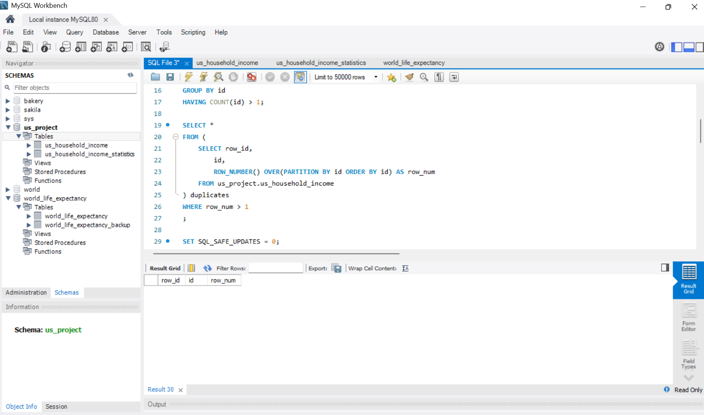
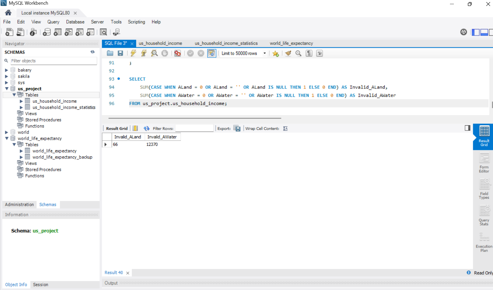
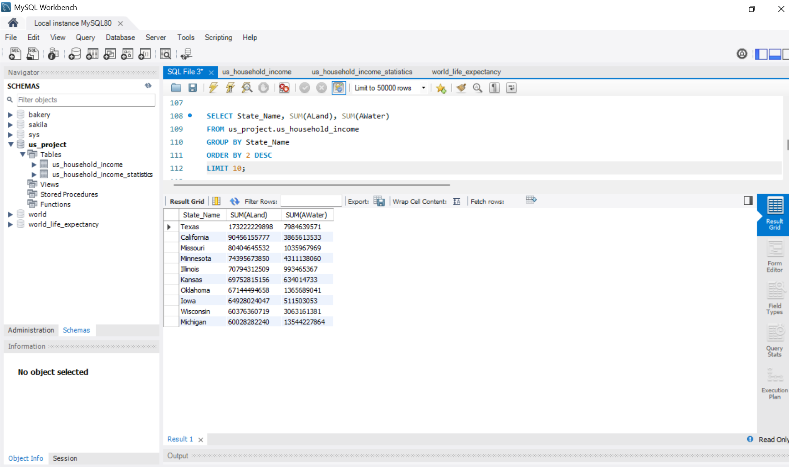
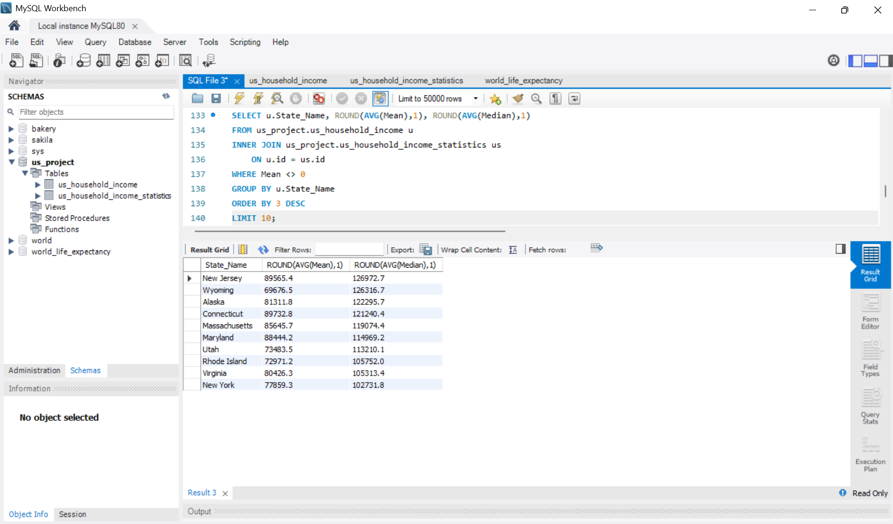
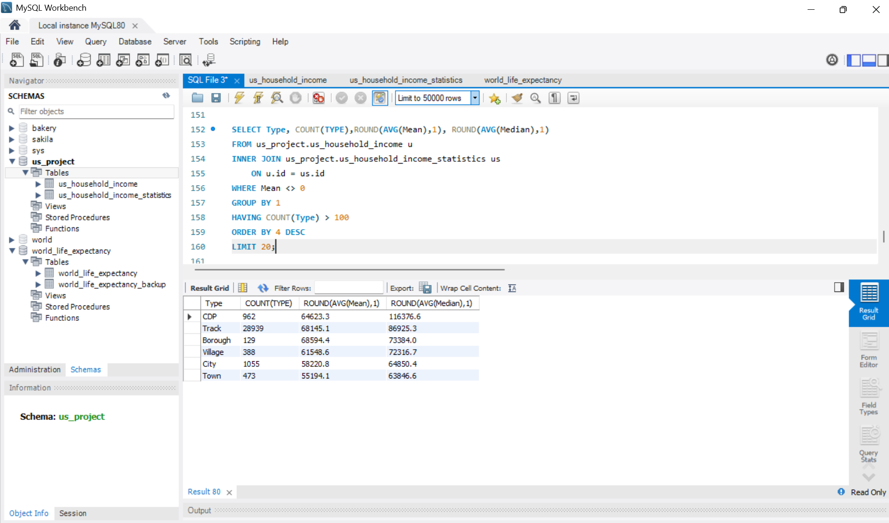

# U.S. Household Income SQL Analysis

## Project Overview

This project demonstrates a complete SQL data-cleaning and exploratory data analysis workflow using U.S. household income data.

Using MySQL, I cleaned inconsistent and duplicate records, standardized geographic information, joined multiple tables, performed data-quality checks, and analyzed income patterns across states, cities, and location types.

## Objectives

- Clean and standardize the household income dataset
- Identify and remove duplicate records
- Correct inconsistent state, place, and location-type values
- Perform data-quality checks on land and water fields
- Join geographic and household income statistics
- Analyze income patterns across states, cities, and location types
- Explore state land and water distributions

## Tools Used

- MySQL
- MySQL Workbench
- SQL
- Window Functions
- Aggregate Functions
- Joins
- CASE Statements

## Dataset

The analysis uses two related tables:

- `us_household_income` — geographic information including state, county, city, place, location type, land area, and water area
- `us_household_income_statistics` — household income statistics including mean and median income

The tables were joined using the shared `id` field.

## Data Cleaning

The cleaning process included:

- Renaming a malformed `id` column
- Identifying duplicate IDs using `ROW_NUMBER()`
- Removing duplicate records
- Standardizing inconsistent state names such as `georia` and `alabama`
- Correcting a place-name inconsistency for Autauga County
- Standardizing `Boroughs` to `Borough`
- Checking `ALand` and `AWater` for zero, blank, or null values

The land and water quality check flagged:

- **66** `ALand` records
- **12,370** `AWater` records

based on the project's zero, blank, or null criteria.

View the complete cleaning script:

[`sql/data_cleaning.sql`](sql/data_cleaning.sql)

## Exploratory Data Analysis

The exploratory analysis examined:

- Top 10 states by total land area
- Top 10 states by total water area
- Average mean and median household income by state
- Income patterns by location type
- Income comparisons among common location types
- Cities with the highest average household income

View the complete analysis:

[`sql/exploratory_analysis.sql`](sql/exploratory_analysis.sql)

## Key Findings

- **Texas** had the largest total land area in the analysis.
- **Michigan** had the largest total water area.
- **New Jersey** had the highest average of the dataset's median-income field among the states returned by the top-state analysis, at approximately **$126,972.70**.
- **Track** was the most common location type in the dataset, with **28,939** records in the analysis.
- Among location types with more than 100 records, **CDP** had the highest average median-income value at approximately **$116,376.60**.
- **Delta Junction, Alaska** ranked highest in the city-level query by average mean income, at approximately **$242,857**.

## Project Screenshots

### Duplicate Verification



### Land and Water Data-Quality Check



### Top States by Land Area



### Income by State



### Income Comparison by Location Type



### Income by City


Additional cleaning and analysis evidence is available in the [`Screenshots`](Screenshots/) folder.

## Repository Structure

```text
us-household-income-sql-analysis/
│
├── README.md
├── sql/
│   ├── data_cleaning.sql
│   └── exploratory_analysis.sql
│
└── Screenshots/
    ├── 01-duplicates-removed.png
    ├── 02-statistics-id-column-fixed.png
    ├── 03-state-names-standardized.png
    ├── 04-place-correction.png
    ├── 05-type-standardization.png
    ├── 06-land-water-quality-check.png
    ├── 07-top-states-by-land-area.png
    ├── 08-top-states-by-water-area.png
    ├── 09-income-by-state.png
    ├── 10-income-by-location-type.png
    ├── 11-common-types-income-comparison.png
    └── 12-income-by-city.png
```

## Author

Hamzah  
GitHub: [hamzaha-bot](https://github.com/hamzaha-bot)